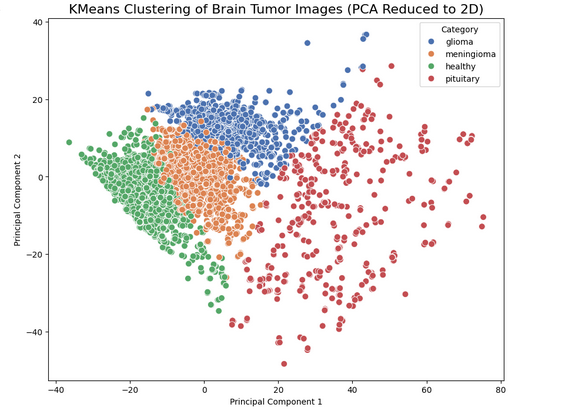

 

 

<h1 align="center">CS 7641 ML Project - Brain Tumor Classification</h1>
<h3>Directory Structure</h3>

- `/outputs/`: Directory for storing output files, including generated figures and model results.
  
- `/src/`: Directory containing source code and Jupyter notebooks for different machine learning experiments.

  - `/src/CNN.ipynb`: Jupyter notebook implementing a Convolutional Neural Network (CNN) for brain tumor image classification.

  - `/src/KMeans.ipynb`: Jupyter notebook performing KMeans clustering on brain tumor images, including dimensionality reduction for visualization.
  - `/src/ResNet50.ipynb`: Jupyter notebook implementing the ResNet50 model for feature extraction and classification in brain tumor image analysis.
  - `/src/GMM.ipynb`: Jupyter notebook implementing the Gaussian Mixture Model (GMM) for clustering brain tumor images and evaluating performance metrics such as accuracy, F1 score, and AUC-ROC.

- `README.md`: Documentation file that provides an overview of the project structure, descriptions of each directory and file, and instructions on how to reproduce the results.
<!-- TABLE OF CONTENTS -->

  
Table of Contents

  <ol>
    <li>
      <a href="#about-the-project">About The Project</a>
      <ul>
        <li><a href="#project-goals">Project Goals</a></li>
      </ul>
    </li>
    <li>
      <a href="#getting-started">Getting Started</a>
      <ul>
        <li><a href="#prerequisites">Prerequisites</a></li>
        <li><a href="#installation">Installation</a></li>
      </ul>
    </li>
    <li><a href="#Implementations">Implementations</a>
    <ul>
        <li><a href="#Supervised">Unsupervised Learning</a>
        <ul>
          <li><a href="#built-with">Built With</a></li>
        </ul>
          </li>
        </li>
      </ul>
    <ul>
        <li><a href="#Unsupervised">Supervised Learning</a>
        <ul>
          <li><a href="#built-with-1">Built With</a></li>
        </ul>
        </li>
      </ul>
    </li>
    <li><a href="#future-work">Future Work</a>
    <li><a href="#references">References</a></li>
  </ol>

<!-- ABOUT THE PROJECT -->
## About The Project

Brain tumors are abnormal cell growths in or around the brain, classified as benign (non-cancerous) or malignant (cancerous). In adults, the primary types include Gliomas (usually malignant), Meningiomas (often benign), and Pituitary tumors (generally benign). Early diagnosis is crucial for improving outcomes and treatment options. This project aims to develop a machine learning model for detecting and classifying brain tumors using MRI images.

Several studies highlight the effectiveness of modern techniques. A YOLOv7-based model with attention mechanisms achieved 99.5% accuracy [1]. Transfer learning models like VGG16 reached 98% accuracy, outperforming traditional CNNs [2]. A CNN optimized with the Grey Wolf Optimization algorithm achieved 99.98% accuracy [3], while MobileNetv3 reached 99.75%, surpassing ResNet and DenseNet [4]. Additionally, one study compared CNNs (96.47%) with Random Forest (86%) for tumor classification [5].

The dataset for this project, “Brain Tumor (MRI scans),” sourced from Kaggle, contains 3,264 MRI images across three tumor types: Gliomas, Meningiomas, and Pituitary tumors, with a balanced distribution of images in various orientations.

Link to the Dataset: https://www.kaggle.com/datasets/rm1000/brain-tumor-mri-scans/data

Manual analysis of MRI scans by radiologists is labor-intensive and error-prone. This project aims to automate the detection and classification of brain tumors (Gliomas, Meningiomas, and Pituitary tumors) to improve accuracy and efficiency compared to existing models.

The solution involves developing a deep learning model using a custom CNN with multiple convolutional, pooling, and fully connected layers. Optimization will utilize Transfer Learning with models like VGG16, ResNet50, and EfficientNet. Performance will be assessed using metrics such as Precision, Recall, Accuracy, F1 Score, and ROC-AUC.

Difference From Prior Literature: Our approach enhances existing methods by utilizing EfficientNetB2 for effective feature extraction and incorporating unsupervised techniques like DBSCAN and GMM to address noise and irregular tumor shapes. This combination leads to improved model performance and faster, more accurate tumor classification.

(<a href="#readme-top">back to top</a>)

### Project Goals

1. Detects and classifies brain tumors through MRI scans.
2. Reduce false positives and detect tumors early.
3. Generates consistent accuracies for different types of brain tumors.
4. Generalizes well to unseen MRI scans.

## Implementations

### Unsupervised Learning
Using **KMeans** clustering for brain tumor detection in this context is a bit unconventional since KMeans is typically an unsupervised learning algorithm, often used for clustering rather than classification. However, there are some goals where KMeans might contribute to the project, primarily in preprocessing, feature extraction, or exploratory analysis:

**Feature Extraction:** KMeans can help identify patterns within the image data. By clustering image patches or pixel intensities, you can potentially discover common features across tumor types. These clusters might represent common textures, edges, or shapes that could then be used as features in a supervised classification model.

**Dimensionality Reduction and Initialization for Deep Learning Models:** The clusters generated by KMeans could serve as a preliminary grouping or an initial feature space, which may then be fed into a more complex model like EfficientNet. For example, KMeans can identify latent patterns, which may improve the learning process of the neural network when used in the initial layers.

**Data Augmentation:** KMeans could be used to create synthetic labels for unlabeled or newly collected data. For example, it could identify subgroups within a "glioma" category that may be hard for human annotators to distinguish but still share common traits. This can assist with labeling or even serve as pseudo-labels to increase the dataset's diversity.

**Exploratory Data Analysis:** Clustering images with KMeans might reveal which types of brain tumors are more similar or have overlapping features, allowing you to gain insight into the structure of the dataset before you start supervised learning. This could help you understand the difficulty of the classification task, for example, by highlighting potential class overlaps.

**Result**:

#### Built With

* [![NumPy][NumPy]][NumPy-url]
* [![Pillow][Pillow]][Pillow-url]
* [![scikit-learn][scikit-learn]][scikit-learn-url]
* [![Matplotlib][Matplotlib]][Matplotlib-url]
* [![Seaborn][Seaborn]][Seaborn-url]

### Supervised Learning
#### CNN
We implemented Convolutional Neural Network (CNN) as well as a part of supervised learning, for brain tumor detection using MRI images. The model is built using batch normalization and dropout regularization, to ensure this model would categorize images that it has not seen before, hence performing well in real diagnostic contexts. This involves some routine steps: resizing the images for consistency, one-hot encoding since it is multi-class classification, and training the model via a categorical cross-entropy loss. CNN-based approaches have driven solid momentum into the advancement of automated medical diagnostics, image classification with the follwoing key features:

**Feature Extraction Convolutional Layers:** These are a number of convolutional layers that automatically extract features from the images, such as edges, textures, and shapes. Preceding this, these layers will, therefore, learn an increasingly complex representation of the input provided. Because of this, it is effective at distinguishing between tumor types with very subtle differences.

**Dense Layers for Classification:** After features are extracted, the flattened data goes through some fully connected or dense layers which combine the learned features and classify. The softmax activation in the last dense layer outputs the probability of each tumor class.

**Data Augmentation and Preprocessing:** These were then resized and normalized for consistency and efficiency. Target labels might be many classes and are one-hot encoded. This setup is good for effectively training the network on medical images, which might come with different intensities and orientations.

**Efficient Optimization and Loss Function:** The model is then implemented with the Adam optimizer, which happens to be one of the most adaptable yet efficient optimizers, and categorical cross-entropy as the loss because it would deal with a multi-class classification task.

#### Built With

* [![TensorFlow][TensorFlow]][TensorFlow-url]
* [![Keras][Keras]][Keras-url]
* [![scikit-learn][scikit-learn]][scikit-learn-url]
* [![NumPy][NumPy]][NumPy-url]

#### ResNet50
**ResNet50**, also known as “Residual Network with 50 layers” is a deep convolutional neural network (CNN) which addresses the issue of vanishing gradients by introducing “residual connections” allowing for the training of very deep networks. ResNet50’s deep architecture captures fine-grained features at multiple levels which helps in distinguishing between different types of brain tumors (e.g., glioma, meningioma, pituitary tumors) as well as healthy tissue. Fine-tuning the top layers of ResNet50 on the brain tumor dataset improves accuracy with relatively less labeled data. It handles depth and complexity which is required in classifying Brain MRI Scans that are usually complex in nature.

**Exploratory Data Analytics**
The resized images of dimensions  128*128 pixels (required input size for ResNet50) are visualized based on each class ('glioma', 'healthy', 'meningioma', 'pituitary')  to ensure that the dataset is balanced. Sample images are also generated from each class.

**Dimensionality Reduction with PCA**
The images are flattened into vectors before applying PCA, which reduces the dimensions to 50 principal components. The cumulative explained variance plot helps in understanding how much variance is captured by the selected components. It indicates whether 50 components are sufficient to retain most of the information.

**One-Hot Encoding Labels**
One-hot encoding labels convert the categorical labels into a format suitable for multi-class classification. It converts ‘y_train_encoded’ and ‘y_test_encoded’ into one-hot encoded arrays for use in the classification layer. 

**ResNet50 Model Training**
A pre-trained ResNet50 model is set up as a feature extractor adding custom layers for the classification task. The model is compiled with categorical cross-entropy loss and accuracy as metrics, appropriate for multi-class classification. Cross-validation with StratifiedKFold performs 5-fold cross-validation to evaluate model performance robustly across different data splits. For each fold, the model is trained on 4 folds of data and validated on the remaining fold. he cross-validation loop calculates the F1 score and ROC-AUC score for each fold, appending the scores to lists for overall performance measurement.

(<a href="#readme-top">back to top</a>)
 

## References

[1] 	A. B. Abdusalomov, M. Mukhiddinov, and T. K. Whangbo, “Brain tumor detection based on deep learning approaches and Magnetic Resonance Imaging,” Cancers, https://www.ncbi.nlm.nih.gov/pmc/articles/PMC10453020/ (accessed Oct. 4, 2024). 

[2] 	M. Z. Khaliki and M. S. Başarslan, “Brain tumor detection from images and comparison with transfer learning methods and 3-layer CNN,” Nature News, https://www.nature.com/articles/s41598-024-52823-9 (accessed Oct. 4, 2024). 

[3] 	H. ZainEldin et al., “Brain tumor detection and classification using deep learning and sine-cosine fitness grey wolf optimization,” Bioengineering (Basel, Switzerland), https://pubmed.ncbi.nlm.nih.gov/36671591/ (accessed Oct. 4, 2024). 

[4] 	S. K. Mathivanan et al., “Employing deep learning and transfer learning for accurate brain tumor detection,” Nature News, https://www.nature.com/articles/s41598-024-57970-7 (accessed Oct. 4, 2024). 

[5] 	S. Saeedi, S. Rezayi, H. Keshavarz, and S. R. N. Kalhori, “MRI-based brain tumor detection using convolutional deep learning methods and chosen machine learning techniques - BMC Medical Informatics and decision making,” BioMed Central, https://bmcmedinformdecismak.biomedcentral.com/articles/10.1186/s12911-023-02114-6 (accessed Oct. 4, 2024). 

(<a href="#readme-top">back to top</a>)

<!-- MARKDOWN LINKS & IMAGES -->
[NumPy]: https://img.shields.io/badge/NumPy-013243?style=for-the-badge&logo=numpy&logoColor=white
[NumPy-url]: https://numpy.org/
[Pillow]: https://img.shields.io/badge/Pillow-FFB8B8?style=for-the-badge&logo=pillow&logoColor=white
[Pillow-url]: https://python-pillow.org/
[scikit-learn]: https://img.shields.io/badge/scikit--learn-F7931E?style=for-the-badge&logo=scikit-learn&logoColor=white
[scikit-learn-url]: https://scikit-learn.org/

[TensorFlow]: https://img.shields.io/badge/TensorFlow-FF6F00?style=for-the-badge&logo=tensorflow&logoColor=white
[TensorFlow-url]: https://www.tensorflow.org/

[Keras]: https://img.shields.io/badge/Keras-D00000?style=for-the-badge&logo=keras&logoColor=white
[Keras-url]: https://keras.io/

[scikit-learn]: https://img.shields.io/badge/scikit--learn-F7931E?style=for-the-badge&logo=scikit-learn&logoColor=white
[scikit-learn-url]: https://scikit-learn.org/

[NumPy]: https://img.shields.io/badge/NumPy-013243?style=for-the-badge&logo=numpy&logoColor=white
[NumPy-url]: https://numpy.org/
[Matplotlib]: https://img.shields.io/badge/Matplotlib-11557C?style=for-the-badge&logo=matplotlib&logoColor=white
[Matplotlib-url]: https://matplotlib.org/
[Seaborn]: https://img.shields.io/badge/Seaborn-1F77B4?style=for-the-badge&logo=seaborn&logoColor=white
[Seaborn-url]: https://seaborn.pydata.org/
